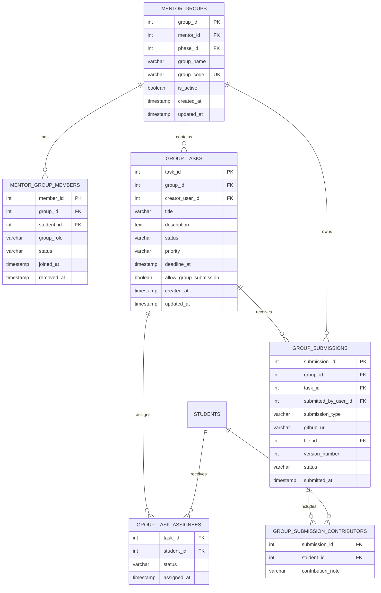

# Business Scope Correction And Group Task Submission Redesign

## Skill Nen Dung

- Bat buoc dung skill local `internship-management-system` trong `SKILL.md`.
- Bat buoc doc cac rule trong `docs/rule` truoc khi code:
  - `docs/rule/http-error-response-rule.md`
  - `docs/rule/skill-query-rule.md`
  - `docs/rule/library-reuse-rule.md`
  - `docs/rule/google-oauth-client-config-rule.md` neu co upload/storage lien quan.
- Truoc khi code, chay skill discovery:

```powershell
npx skills find "database design schema normalization spring boot erd"
npx skills find "internship management group task submission workflow react spring boot"
```

- Bat buoc doc/use `design-doc-mermaid` de tao ERD/database design neu co san.
- Bat buoc doc/use `spring-boot-crud-patterns` khi thiet ke entity/repository/service/API.
- Bat buoc doc/use `spring-boot-test-patterns` khi them/chinh test backend.
- Bat buoc doc/use `frontend-design` khi sua UI student/mentor/admin.

Ghi chu: neu `npx skills find` bi loi cache/network, agent phai ghi ro loi, khong bo qua viec doc cac skill local san co.

## Muc Tieu

Dieu chinh lai scope nghiep vu cua he thong theo feedback moi:

1. Day la he thong cua doanh nghiep/to chuc quan ly thong tin thuc tap sinh, khong phai portal cho student tu dang ky thuc tap.
2. Bo tinh nang Student self-register internship/application khoi Student Management va UI student neu khong con dung scope.
3. Sua module Company & Internship cho dung scope moi: Admin/Mentor/Company-side quan ly intern, assignment, group, task, submission, evaluation.
4. Student co muc theo doi bai tap/task duoc giao va trang thai task/submission.
5. Bai tap student thay trong submission phai lay tu group tasks ma mentor da assign, khong phai danh sach submission rieng le hardcode hoac tu tao tuy y.
6. Khi mentor giao task trong group, mentor chon students trong group duoc assign; UI phai co nut/chon mac dinh `select all members`.
7. Database phai duoc thiet ke chuan: normalized, co constraint, index, data scope, audit, query pattern va ERD ro rang.

## Scope Correction Bat Buoc

### Bo khoi Student Management

Khong con xem `Student dang ky thuc tap` la tinh nang chinh cua student.

Can audit va xu ly:

- Sidebar/menu cua student khong hien `Applications`/`Internship Registration` neu workflow nay khong dung nua.
- Route student vao trang dang ky thuc tap phai bi an/chan hoac chuyen thanh read-only status neu business van can lich su.
- API create application tu student can duoc danh dau deprecated/chan bang feature flag neu task 13 da co.
- Tai lieu roadmap/module list phai cap nhat: Student Management khong chua self-registration internship.

Neu van can `InternshipApplication` cho admin/import du lieu, scope moi la admin/mentor/operator tao hoac quan ly ho so internship, khong phai student tu dang ky.

### Sua Company & Internship Scope

Module Company & Internship nen tap trung vao:

- Quan ly cong ty/bo phan/du an tiep nhan intern.
- Quan ly intern profile.
- Gan intern vao mentor/group/company/project/phase.
- Quan ly group task/deadline/submission/evaluation.
- Theo doi workload mentor va phan bo intern theo company/project.
- Khong mo ta flow la student tu nop don xin thuc tap neu he thong nay do doanh nghiep quan ly intern noi bo.

## Student Task/Submission Flow Moi

Student co mot muc rieng, vi du `My Tasks` hoac `Assignments`, de theo doi bai tap duoc giao trong group.

Student thay:

- Task title/description.
- Group/mentor/project lien quan.
- Deadline.
- Priority/status.
- Assignees trong group.
- Submission status: NOT_SUBMITTED, SUBMITTED, REVIEWED, NEEDS_CHANGES, ACCEPTED, REJECTED.
- Latest submission version.
- Mentor feedback/score neu da publish va role/feature cho phep.
- Action submit/resubmit neu con deadline va co quyen.

Nguon du lieu bat buoc:

```text
MentorGroup -> GroupTask -> GroupTaskAssignee -> GroupSubmission
```

Khong render task/submission tu mock data neu backend da co API.

## Mentor Group Task Assignment Flow

Khi mentor tao/giao task trong group:

- Mentor chi chon students la active members cua group.
- UI hien danh sach member co checkbox.
- Co nut/chon mac dinh `Select all members`.
- Default khi tao task nen chon tat ca active members, vi intern thuong lam bai theo nhom.
- Mentor co the bo chon mot vai member neu task chi giao cho subset.
- Task phai luu assignees ro rang de student page query dung task cua minh.
- Neu submission la group submission, van luu duoc danh sach contributors/assignees de review minh bach.

## Database Design Tieu Chuan Bat Buoc

Truoc khi implement DB, agent phai tao/thuc hien database design note hoac section trong final voi cac muc:

1. ERD bang Mermaid `erDiagram`.
2. Table specifications.
3. Primary keys, foreign keys.
4. Unique constraints.
5. Check constraints cho status/role/type neu dung string enum.
6. Index strategy theo query pattern.
7. Data access pattern cho Student My Tasks, Mentor Group Task, Admin Oversight.
8. Normalization level toi thieu 3NF, ghi ro field nao denormalize neu co va ly do.
9. Soft delete/status strategy.
10. Audit fields va audit logs cho action quan trong.
11. Data scope/security rule cho tung query.
12. Migration strategy an toan neu sua bang dang co.

## Database Model De Xuat

Reuse va dieu chinh cac bang tu task 12/15. Model toi thieu:



Critical constraints:

- `mentor_group_members`: unique active membership per `group_id + student_id`.
- `group_task_assignees`: primary/unique key `task_id + student_id`.
- `group_submissions`: unique `task_id + version_number` or version scoped by group/task.
- `group_submissions.task_id` must belong to same `group_id`.
- `group_task_assignees.student_id` must be active member of the same group; enforce in service, and DB constraint if feasible.
- `github_url` required when submission_type = GITHUB_LINK.
- `file_id` required when submission_type = ZIP_FILE.

Critical indexes:

- `idx_group_members_group_status` on `group_id, status`.
- `idx_group_members_student_status` on `student_id, status`.
- `idx_group_tasks_group_status_deadline` on `group_id, status, deadline_at`.
- `idx_task_assignees_student_status` on `student_id, status`.
- `idx_group_submissions_task_version` on `task_id, version_number desc`.
- `idx_group_submissions_group_status` on `group_id, status`.

## Backend API Can Co

### Student My Tasks

- `GET /api/student/tasks?status=&groupId=&overdue=`
- `GET /api/student/tasks/{taskId}`
- `POST /api/student/tasks/{taskId}/submissions/github`
- `POST /api/student/tasks/{taskId}/submissions/zip` multipart, reuse task 14 storage.
- `GET /api/student/tasks/{taskId}/submissions`

### Mentor Group Tasks

- `POST /api/mentor-groups/{groupId}/tasks` voi `assigneeStudentIds` optional; neu null/empty va `assignAllMembers=true` thi assign all active members.
- `PUT /api/mentor-groups/{groupId}/tasks/{taskId}` update title/description/deadline/priority/status/assignees.
- `PATCH /api/mentor-groups/{groupId}/tasks/{taskId}/assignees` de add/remove assignees.
- `GET /api/mentor-groups/{groupId}/tasks/{taskId}/submissions`.
- `POST /api/mentor-groups/{groupId}/tasks/{taskId}/submissions/{submissionId}/review`.

Create task request de xuat:

```json
{
  "title": "Build login module",
  "description": "Implement FE/BE login flow",
  "deadlineAt": "2026-03-20T23:59:00",
  "priority": "HIGH",
  "assignAllMembers": true,
  "assigneeStudentIds": []
}
```

Neu `assignAllMembers = true`, backend phai lay tat ca active members trong group, khong tin vao FE gui thieu/du ID.

### Admin Oversight

- `GET /api/admin/group-tasks?groupId=&mentorId=&studentId=&status=&overdue=`
- `GET /api/admin/group-submissions?groupId=&taskId=&studentId=&status=`
- `GET /api/admin/group-tasks/{taskId}` detail gom assignees, submissions, reviews, audit.

## Frontend Can Sua/Them

### Student

- Bo/hide menu dang ky thuc tap neu khong dung scope moi.
- Them page `My Tasks` hoac dieu chinh `Submissions` thanh trang theo doi task duoc giao.
- Task list compact: title, group, mentor, deadline, priority, status, submission status.
- Detail task: description, assignees, latest submission, feedback, submit/resubmit action.
- Submit modal cho GitHub link hoac ZIP file reuse task 14.
- Khong cho student tu tao task/submission ngoai task duoc assign.

### Mentor

- Khi tao task trong group, hien member picker.
- Default checked all active members.
- Co nut `Select all members` va `Clear selection`.
- Hien assignee count truoc khi save.
- Validate phai co it nhat 1 assignee neu task can student lam.
- Task detail hien submissions cua group/task va ai da submit/contributors.

### Admin

- Admin view/task oversight xem duoc moi group task/submission.
- Filter theo mentor/group/student/status/deadline.
- Admin xem chi tiet hon mentor: audit, version history, contributors, file metadata.

## Documentation Update Bat Buoc

Cap nhat cac docs/task lien quan neu con mo ta sai scope:

- Roadmap feature list: Student Management khong con `Dang ky thuc tap`.
- Module Company & Internship phai theo huong doanh nghiep quan ly intern.
- Submission docs phai noi ro submission lay tu group task assigned.
- Group docs phai noi ro mentor assign task cho members, default select all.

## Permission Va Data Scope

- Student chi thay tasks ma student la assignee hoac la active member neu task la group-wide.
- Student chi submit vao task duoc assign va trong group active cua minh.
- Mentor chi CRUD task/submission review trong group minh quan ly.
- Admin xem toan bo.
- Student khong thay grading/review/admin actions.
- Role khong du quyen phai bi an menu/action va backend tra 403 theo task 13.

## Error Handling

- Student submit task khong duoc assign: 403.
- Student submit sau deadline khi khong cho phep: 422.
- Mentor assign student khong thuoc group: 422.
- Mentor tao task khong assignee khi task bat buoc co assignee: 400.
- Task/submission/group khong ton tai: 404.
- Duplicate submission version conflict: 409 neu co.

## Test Can Co

Backend:

- Mentor create task voi `assignAllMembers=true` assign dung tat ca active members.
- Mentor create task voi subset chi assign nhung student active trong group.
- Mentor assign student ngoai group bi 422/403 theo rule.
- Student list tasks chi thay task duoc assign.
- Student submit GitHub/ZIP vao task duoc assign thanh cong.
- Student submit task khong duoc assign bi 403.
- Student khong tao application/self internship registration neu feature da disable.
- Admin xem duoc tat ca tasks/submissions.
- Index/query projection khong tao N+1 trong list tasks/submissions.

Frontend:

- Student menu khong con hien registration/application sai scope.
- Student My Tasks/Submissions lay data tu assigned group tasks.
- Mentor task create default select all active members.
- Mentor co Select all/Clear selection va assignee count.
- Student khong thay action review/grade/admin.
- Admin oversight hien du filter/detail.
- `npm run lint` pass.
- `npm run build` pass.

## Acceptance Criteria

- Scope he thong duoc sua thanh doanh nghiep/to chuc quan ly thuc tap sinh, khong phai student self-register internship portal.
- Student Management khong con registration internship trong menu/flow chinh.
- Company & Internship module dung scope moi: manage company/project/intern/mentor/group/task/evaluation.
- Student submission page theo doi tasks assigned tu group va submit tai do.
- Mentor giao task trong group co member picker, default select all active members.
- Database design co ERD, constraints, indexes, access patterns va normalized schema ro rang.
- Backend enforce data scope dung.
- FE an dung menu/action ngoai role.
- Backend test pass.
- FE lint/build pass.

## GitHub Push Sau Khi Hoan Thanh Task

Sau khi hoan thanh task `16-business-scope-group-task-submission-redesign`, commit va push rieng task nay.

```powershell
git status
cd BE
.\gradlew.bat test
cd ..\FE
npm run lint
npm run build
git add <cac-file-task-16-da-sua>
git commit -m "feat: align intern workflow with group task submissions"
git push origin <branch-name>
```

Khong gom thay doi cua task khac neu cac task do chua duoc thuc hien/push rieng.
